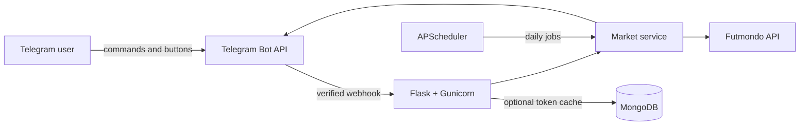

<div align="center">

# ⚽ Futmondo Telegram Bot

### Manage your Futmondo league directly from Telegram

Market alerts, team finances, interactive bids, player sales, transfers and scheduled daily digests — all from a private Telegram bot.

[](https://www.python.org/)
[](https://flask.palletsprojects.com/)
[](https://core.telegram.org/bots)
[](https://docs.docker.com/compose/)
[](#quality-and-testing)

</div>

> [!IMPORTANT]
> Futmondo Telegram Bot is an unofficial community project. Futmondo does not publish these endpoints as a stable public API, so upstream changes may require maintenance.

## What is it?

**Futmondo Telegram Bot** connects a Futmondo championship to a private Telegram chat. Instead of opening the Futmondo application repeatedly, you can inspect the market, review your budget, place or update bids with inline buttons, manage player sales and receive automatic cron notifications.

The project is inspired by [vicenteqa/futmondo-utils](https://github.com/vicenteqa/futmondo-utils), with its most useful workflows consolidated into a maintainable, tested Python service.

## Highlights

| Area | Capabilities |
| --- | --- |
| 📲 Telegram | Private command bot, command menu, inline bid buttons and webhook verification |
| 📈 Market | Sort by value change, price, bids, average or recent form |
| 💰 Finances | Budget, withheld money, available balance and maximum bid |
| 🔨 Trading | Place/update bids and explicitly create or cancel player sales |
| 📰 League | Transfers, teams, rosters, active championships and last connections |
| ⏰ Automation | Independent market and transfer digests using configurable cron expressions |
| 🔐 Security | Chat allowlist, Telegram secret, protected write API and protected cron hooks |
| 🐳 Operations | Docker image, Docker Compose, health check and Nginx Proxy Manager support |

The client also discovers the Futmondo account user ID automatically. If configured championship IDs become stale and the account has exactly one active championship, the current championship and team are selected automatically.

## Telegram commands

| Command | Description |
| --- | --- |
| `/market [change\|bids\|price\|form\|average]` | Show and sort the current market |
| `/wanted` | Show rising players currently owned by the CPU |
| `/budget` | Show team finances and maximum bid |
| `/transfers` | Show today's championship transfers |
| `/team <name>` | Find a team and display its roster |
| `/connections` | Show the most recent manager connections |
| `/bid <player_id> <amount>` | Place or update a bid |
| `/sales` | Show your active player sales |
| `/sell <player_id> <price>` | Put a player on the market |
| `/cancel_sale <player_id>` | Remove a player from the market |
| `/help` | Display the command guide |

Market messages include **Bid +5%**, **Bid +10%** and **Bid +15%** buttons. Telegram update IDs are deduplicated so webhook retries do not repeat a trading action.

## Architecture



Docker Compose runs two processes from the same image:

- `futmondojobs`: Flask/Gunicorn API and Telegram webhook.
- `scheduler`: a single APScheduler process for recurring notifications.

Cron is deliberately kept outside Gunicorn so multiple web threads cannot schedule duplicate digests.

## Production deployment

### 1. Requirements

- A server with Docker Engine and Docker Compose v2.
- A Telegram bot token created with [@BotFather](https://t.me/BotFather) using `/newbot`.
- Your Telegram numeric chat ID.
- A Futmondo account with an active championship.
- A public HTTPS domain for Telegram webhooks.
- An existing Docker network named `npm-network` when using the included Compose file.

### 2. Clone the repository

```bash
git clone https://github.com/lluc898/futmondojobs.git
cd futmondojobs
```

Create the proxy network if Nginx Proxy Manager has not created it already:

```bash
docker network create npm-network
```

### 3. Configure environment variables

```bash
cp .env.example .env
```

Edit `.env`:

```dotenv
# Futmondo
FUTMONDO_EMAIL=manager@example.com
FUTMONDO_PASSWORD=replace-me
FUTMONDO_CHAMPIONSHIP_ID=
FUTMONDO_TEAM_ID=

# Telegram
TELEGRAM_BOT_TOKEN=123456789:replace-me
TELEGRAM_CHAT_ID=123456789
TELEGRAM_ALLOWED_CHAT_IDS=123456789
TELEGRAM_WEBHOOK_SECRET=replace-with-a-long-random-value

# Protected HTTP actions
API_KEY=replace-with-a-long-random-value
CRON_SECRET=replace-with-a-long-random-value

# Scheduled notifications (Europe/Madrid)
TZ=Europe/Madrid
MARKET_DIGEST_CRON=0 7 * * *
TRANSFERS_DIGEST_CRON=45 7 * * *
MARKET_PLAYER_LIMIT=20

# Optional shared token cache
MONGODB_URI=
```

`FUTMONDO_CHAMPIONSHIP_ID` and `FUTMONDO_TEAM_ID` may be left empty when the account has exactly one active championship. They should be set explicitly when the account has several.

Generate secrets on Linux:

```bash
openssl rand -hex 32
```

Or with PowerShell:

```powershell
[Convert]::ToHexString([Security.Cryptography.RandomNumberGenerator]::GetBytes(32)).ToLower()
```

Before registering the webhook, send a message to your new bot and obtain your chat ID:

```text
https://api.telegram.org/bot<TELEGRAM_BOT_TOKEN>/getUpdates
```

Use the numeric value under `message.chat.id`.

### 4. Build and start

```bash
docker compose up -d --build
```

Check both containers:

```bash
docker compose ps
docker compose logs --tail=100 futmondojobs scheduler
curl http://localhost:5000/health
```

A healthy response looks like:

```json
{
  "status": "ok",
  "futmondo_configured": true,
  "telegram_configured": true,
  "shared_token_cache": false
}
```

### 5. Configure HTTPS with Nginx Proxy Manager

Create a Proxy Host with these values:

| Setting | Value |
| --- | --- |
| Domain | `futmondo.example.com` |
| Scheme | `http` |
| Forward hostname | `futmondojobs` |
| Forward port | `5000` |
| WebSockets | Not required |
| SSL | Request a Let's Encrypt certificate |
| Force SSL | Enabled |

Both Nginx Proxy Manager and `futmondojobs` must be connected to `npm-network`.

### 6. Register the Telegram webhook

Once the public HTTPS URL works:

```bash
docker compose run --rm futmondojobs \
  python manage.py set-webhook https://futmondo.example.com
```

This registers:

```text
https://futmondo.example.com/telegram/webhook
```

It also publishes the Telegram command menu. The webhook uses `TELEGRAM_WEBHOOK_SECRET`; if it is omitted, a stable private value is derived from the bot token.

Open Telegram and test:

```text
/help
/budget
/market
```

## Cron and scheduled notifications

The `scheduler` container starts automatically with Compose.

```dotenv
# Daily at 07:00
MARKET_DIGEST_CRON=0 7 * * *

# Daily at 07:45
TRANSFERS_DIGEST_CRON=45 7 * * *
```

Expressions use the standard five-field cron format and the timezone configured in `TZ`.

Run a digest manually:

```bash
docker compose exec scheduler python manage.py market-digest
docker compose exec scheduler python manage.py transfers-digest
```

You can alternatively call the protected hooks from an external cron provider:

```bash
curl -X POST \
  -H "Authorization: Bearer $CRON_SECRET" \
  https://futmondo.example.com/jobs/market-digest
```

Do not enable both scheduling methods for the same digest unless duplicate notifications are intentional.

## HTTP API

### Read endpoints

| Method | Endpoint | Purpose |
| --- | --- | --- |
| `GET` | `/health` | Application readiness |
| `GET` | `/api/championships` | Active championships and own teams |
| `GET` | `/api/players?sort=change&order=desc` | Current market |
| `GET` | `/api/players/wanted` | Rising CPU players |
| `GET` | `/api/budget` | Team finances |
| `GET` | `/api/transfers?today=true` | Transfer feed |
| `GET` | `/api/teams` | Championship teams |
| `GET` | `/api/teams/<team_id>/players` | Team roster |
| `GET` | `/api/sales` | Own active sales |

### Protected write endpoints

`POST /api/bids`, `POST /api/sales` and `DELETE /api/sales/<player_id>` require `API_KEY`:

```bash
curl -X POST https://futmondo.example.com/api/bids \
  -H "Authorization: Bearer $API_KEY" \
  -H "Content-Type: application/json" \
  -d '{"player_id":"player-id","price":1200000}'
```

If `API_KEY` is empty, write endpoints remain disabled.

## Updating an existing installation

```bash
git pull --ff-only
docker compose up -d --build
docker compose run --rm futmondojobs \
  python manage.py set-webhook https://futmondo.example.com
docker image prune -f
```

## Local development

```bash
python -m venv .venv
```

Windows:

```powershell
.venv\Scripts\pip install -r requirements-dev.txt
.venv\Scripts\pytest
.venv\Scripts\ruff check .
```

Linux/macOS:

```bash
.venv/bin/pip install -r requirements-dev.txt
.venv/bin/pytest
.venv/bin/ruff check .
```

## Quality and testing

External services are mocked in the automated suite. Tests never send Telegram messages or perform real bids and sales.

```bash
python -m pytest
python -m ruff check .
python -m compileall -q .
```

Current status: **10 tests passing**.

## Security notes

- Never commit `.env`; it is already ignored by Git.
- Restrict `TELEGRAM_ALLOWED_CHAT_IDS` to trusted chats.
- Use long random values for all secrets.
- Keep bid and sale endpoints behind HTTPS.
- Telegram API errors are sanitized so the bot token cannot leak into logs.
- MongoDB is optional. When used, restrict network access and create a least-privilege user.
- Trading actions are explicit. The scheduler only sends notifications and never buys or sells automatically.

## Troubleshooting

### The webhook returns `401 Unauthorized`

Run `set-webhook` again after changing `TELEGRAM_WEBHOOK_SECRET`:

```bash
docker compose run --rm futmondojobs \
  python manage.py set-webhook https://futmondo.example.com
```

### The bot does not answer

```bash
docker compose logs --tail=200 futmondojobs
curl https://futmondo.example.com/health
```

Confirm that your chat ID is present in `TELEGRAM_ALLOWED_CHAT_IDS`.

### MongoDB cannot connect

MongoDB is only a shared token cache. Remove or empty `MONGODB_URI` and restart; the application will safely use process memory:

```bash
docker compose up -d --force-recreate
```

### Futmondo returns `not_found`

Open `/api/championships`. If several championships are active, copy the desired championship and team IDs into `.env`, then restart both containers.

## Disclaimer

This project is not affiliated with or endorsed by Futmondo or Telegram. Use it responsibly and at your own risk, especially when enabling trading actions.

<div align="center">

Built for people who would rather manage their fantasy team from Telegram. ⚽📲

</div>
