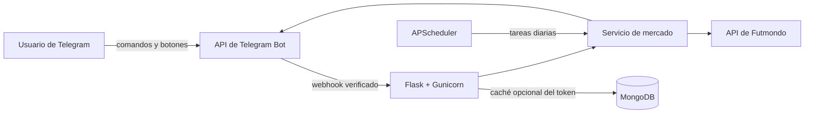

<div align="center">

# ⚽ Bot de Telegram para Futmondo

### Gestiona tu liga de Futmondo directamente desde Telegram

Alertas de mercado, finanzas del equipo, pujas interactivas, venta de jugadores, fichajes y resúmenes diarios programados, todo desde un bot privado de Telegram.

[](https://www.python.org/)
[](https://flask.palletsprojects.com/)
[](https://core.telegram.org/bots)
[](https://docs.docker.com/compose/)
[](#calidad-y-pruebas)

</div>

> [!IMPORTANT]
> Bot de Telegram para Futmondo es un proyecto comunitario no oficial. Futmondo no publica estos endpoints como una API pública estable, por lo que futuros cambios en su servicio podrían requerir mantenimiento.

## ¿Qué es este proyecto?

**Bot de Telegram para Futmondo** conecta un campeonato de Futmondo con un chat privado de Telegram. En lugar de abrir constantemente la aplicación de Futmondo, permite consultar el mercado, revisar el presupuesto, realizar o modificar pujas con botones, gestionar la venta de jugadores y recibir notificaciones automáticas mediante cron.

## Funcionalidades principales

| Área | Funcionalidades |
| --- | --- |
| 📲 Telegram | Bot privado, menú de comandos, botones de puja y verificación del webhook |
| 📈 Mercado | Ordenación por cambio de valor, precio, pujas, media o estado de forma |
| 💰 Finanzas | Presupuesto, dinero retenido, saldo disponible y puja máxima |
| 🔨 Operaciones | Crear o modificar pujas y poner o retirar jugadores del mercado |
| 📰 Liga | Fichajes, equipos, plantillas, campeonatos activos y últimas conexiones |
| ⏰ Automatización | Resúmenes independientes de mercado y fichajes mediante expresiones cron |
| 🔐 Seguridad | Lista de chats permitidos, secreto de Telegram, API y cron protegidos |
| 🐳 Despliegue | Imagen Docker, Docker Compose, health check y soporte para Nginx Proxy Manager |

El cliente descubre automáticamente el ID de usuario de Futmondo. Si los IDs configurados del campeonato quedan obsoletos y la cuenta solo tiene un campeonato activo, también selecciona automáticamente el campeonato y el equipo actuales.

## Comandos de Telegram

| Comando | Descripción |
| --- | --- |
| `/market [change\|bids\|price\|form\|average]` | Muestra y ordena el mercado actual |
| `/wanted` | Muestra jugadores en subida que pertenecen a la CPU |
| `/budget` | Muestra las finanzas del equipo y la puja máxima |
| `/transfers` | Muestra los fichajes de hoy en el campeonato |
| `/team <nombre>` | Busca un equipo y muestra su plantilla |
| `/connections` | Muestra las conexiones más recientes de los participantes |
| `/bid <player_id> <importe>` | Realiza o modifica una puja |
| `/sales` | Muestra tus jugadores actualmente en venta |
| `/sell <player_id> <precio>` | Pone un jugador en el mercado |
| `/cancel_sale <player_id>` | Retira un jugador del mercado |
| `/help` | Muestra la ayuda del bot |

Los mensajes del mercado incluyen botones para **pujar +5 %**, **pujar +10 %** y **pujar +15 %**. Los identificadores de actualización de Telegram se deduplican para evitar que un reintento del webhook repita una operación.

## Arquitectura



Docker Compose ejecuta dos procesos independientes usando la misma imagen:

- `futmondojobs`: API Flask/Gunicorn y webhook de Telegram.
- `scheduler`: un único proceso APScheduler para las notificaciones programadas.

El cron se ejecuta fuera de Gunicorn para impedir que los hilos del servidor web programen resúmenes duplicados.

## Despliegue en producción

### 1. Requisitos

- Un servidor con Docker Engine y Docker Compose v2.
- Un token de bot de Telegram creado con [@BotFather](https://t.me/BotFather) mediante `/newbot`.
- El ID numérico de tu chat de Telegram.
- Una cuenta de Futmondo con al menos un campeonato activo.
- Un dominio público con HTTPS para el webhook de Telegram.
- Una red Docker llamada `npm-network` para utilizar el archivo Compose incluido.

### 2. Clonar el repositorio

```bash
git clone https://github.com/lluc898/futmondojobs.git
cd futmondojobs
```

Si Nginx Proxy Manager todavía no ha creado la red, créala manualmente:

```bash
docker network create npm-network
```

### 3. Configurar las variables de entorno

```bash
cp .env.example .env
```

Edita `.env`:

```dotenv
# Futmondo
FUTMONDO_EMAIL=manager@example.com
FUTMONDO_PASSWORD=cambia-esta-contraseña
FUTMONDO_CHAMPIONSHIP_ID=
FUTMONDO_TEAM_ID=

# Telegram
TELEGRAM_BOT_TOKEN=123456789:cambia-este-token
TELEGRAM_CHAT_ID=123456789
TELEGRAM_ALLOWED_CHAT_IDS=123456789
TELEGRAM_WEBHOOK_SECRET=sustituye-por-un-valor-aleatorio-largo

# Acciones HTTP protegidas
API_KEY=sustituye-por-un-valor-aleatorio-largo
CRON_SECRET=sustituye-por-un-valor-aleatorio-largo

# Notificaciones programadas en Europe/Madrid
TZ=Europe/Madrid
MARKET_DIGEST_CRON=0 7 * * *
TRANSFERS_DIGEST_CRON=45 7 * * *
MARKET_PLAYER_LIMIT=20

# Caché compartida opcional para el token
MONGODB_URI=
```

`FUTMONDO_CHAMPIONSHIP_ID` y `FUTMONDO_TEAM_ID` pueden dejarse vacíos cuando la cuenta solo tiene un campeonato activo. Si existen varios campeonatos, deben configurarse explícitamente.

Genera secretos seguros en Linux:

```bash
openssl rand -hex 32
```

O mediante PowerShell:

```powershell
[Convert]::ToHexString([Security.Cryptography.RandomNumberGenerator]::GetBytes(32)).ToLower()
```

Antes de registrar el webhook, envía un mensaje al bot recién creado y obtén el ID de tu chat:

```text
https://api.telegram.org/bot<TELEGRAM_BOT_TOKEN>/getUpdates
```

Utiliza el valor numérico que aparece en `message.chat.id`.

### 4. Construir e iniciar los contenedores

```bash
docker compose up -d --build
```

Comprueba el estado de los dos contenedores:

```bash
docker compose ps
docker compose logs --tail=100 futmondojobs scheduler
curl http://localhost:5000/health
```

Una respuesta correcta tendrá este aspecto:

```json
{
  "status": "ok",
  "futmondo_configured": true,
  "telegram_configured": true,
  "shared_token_cache": false
}
```

### 5. Configurar HTTPS con Nginx Proxy Manager

Crea un Proxy Host con los siguientes valores:

| Ajuste | Valor |
| --- | --- |
| Dominio | `futmondo.example.com` |
| Esquema | `http` |
| Hostname de destino | `futmondojobs` |
| Puerto de destino | `5000` |
| WebSockets | No son necesarios |
| SSL | Solicitar un certificado de Let's Encrypt |
| Force SSL | Activado |

Nginx Proxy Manager y `futmondojobs` deben estar conectados a `npm-network`.

### 6. Registrar el webhook de Telegram

Cuando la URL pública con HTTPS esté funcionando:

```bash
docker compose run --rm futmondojobs \
  python manage.py set-webhook https://futmondo.example.com
```

Este comando registra la siguiente dirección:

```text
https://futmondo.example.com/telegram/webhook
```

También publica el menú de comandos del bot. El webhook utiliza `TELEGRAM_WEBHOOK_SECRET`; si se deja vacío, la aplicación deriva un valor privado estable a partir del token del bot.

Abre Telegram y prueba los siguientes comandos:

```text
/help
/budget
/market
```

## Cron y notificaciones programadas

El contenedor `scheduler` se inicia automáticamente mediante Docker Compose.

```dotenv
# Todos los días a las 07:00
MARKET_DIGEST_CRON=0 7 * * *

# Todos los días a las 07:45
TRANSFERS_DIGEST_CRON=45 7 * * *
```

Las expresiones usan el formato cron estándar de cinco campos y la zona horaria configurada en `TZ`.

Ejecuta manualmente cualquiera de los resúmenes:

```bash
docker compose exec scheduler python manage.py market-digest
docker compose exec scheduler python manage.py transfers-digest
```

Como alternativa, un servicio cron externo puede llamar a los endpoints protegidos:

```bash
curl -X POST \
  -H "Authorization: Bearer $CRON_SECRET" \
  https://futmondo.example.com/jobs/market-digest
```

No actives los dos métodos para el mismo resumen salvo que quieras recibir notificaciones duplicadas.

## API HTTP

### Endpoints de lectura

| Método | Endpoint | Función |
| --- | --- | --- |
| `GET` | `/health` | Estado y disponibilidad de la aplicación |
| `GET` | `/api/championships` | Campeonatos activos y equipos propios |
| `GET` | `/api/players?sort=change&order=desc` | Mercado actual |
| `GET` | `/api/players/wanted` | Jugadores en subida pertenecientes a la CPU |
| `GET` | `/api/budget` | Finanzas del equipo |
| `GET` | `/api/transfers?today=true` | Fichajes del campeonato |
| `GET` | `/api/teams` | Equipos del campeonato |
| `GET` | `/api/teams/<team_id>/players` | Plantilla de un equipo |
| `GET` | `/api/sales` | Jugadores propios actualmente en venta |

### Endpoints de escritura protegidos

`POST /api/bids`, `POST /api/sales` y `DELETE /api/sales/<player_id>` requieren `API_KEY`:

```bash
curl -X POST https://futmondo.example.com/api/bids \
  -H "Authorization: Bearer $API_KEY" \
  -H "Content-Type: application/json" \
  -d '{"player_id":"player-id","price":1200000}'
```

Si `API_KEY` está vacío, todos los endpoints de escritura permanecen desactivados.

## Actualizar una instalación existente

```bash
git pull --ff-only
docker compose up -d --build
docker compose run --rm futmondojobs \
  python manage.py set-webhook https://futmondo.example.com
docker image prune -f
```

## Desarrollo local

```bash
python -m venv .venv
```

Windows:

```powershell
.venv\Scripts\pip install -r requirements-dev.txt
.venv\Scripts\pytest
.venv\Scripts\ruff check .
```

Linux y macOS:

```bash
.venv/bin/pip install -r requirements-dev.txt
.venv/bin/pytest
.venv/bin/ruff check .
```

## Calidad y pruebas

Todos los servicios externos se simulan en la suite automatizada. Las pruebas nunca envían mensajes de Telegram ni realizan pujas o ventas reales.

```bash
python -m pytest
python -m ruff check .
python -m compileall -q .
```

Estado actual: **10 pruebas superadas**.

## Recomendaciones de seguridad

- Nunca subas `.env` al repositorio; ya está excluido mediante `.gitignore`.
- Limita `TELEGRAM_ALLOWED_CHAT_IDS` únicamente a chats de confianza.
- Utiliza valores largos y aleatorios para todos los secretos.
- Mantén los endpoints de pujas y ventas detrás de HTTPS.
- Los errores de Telegram se limpian para impedir que el token aparezca en los logs.
- MongoDB es opcional. Si lo utilizas, restringe el acceso de red y crea un usuario con los mínimos permisos.
- Todas las operaciones de mercado requieren una acción explícita. El scheduler solo envía notificaciones y nunca compra o vende automáticamente.

## Solución de problemas

### El webhook devuelve `401 Unauthorized`

Vuelve a registrar el webhook después de cambiar `TELEGRAM_WEBHOOK_SECRET`:

```bash
docker compose run --rm futmondojobs \
  python manage.py set-webhook https://futmondo.example.com
```

### El bot no responde

```bash
docker compose logs --tail=200 futmondojobs
curl https://futmondo.example.com/health
```

Comprueba que el ID del chat está incluido en `TELEGRAM_ALLOWED_CHAT_IDS`.

### MongoDB no puede conectarse

MongoDB solo se usa como caché compartida para el token. Elimina o vacía `MONGODB_URI` y reinicia; la aplicación utilizará memoria local de forma segura:

```bash
docker compose up -d --force-recreate
```

### Futmondo devuelve `not_found`

Abre `/api/championships`. Si existen varios campeonatos activos, copia los IDs del campeonato y del equipo deseados en `.env` y reinicia los dos contenedores.

## Aviso legal

Este proyecto no está afiliado ni respaldado por Futmondo o Telegram. Utilízalo de forma responsable y bajo tu propio riesgo, especialmente al habilitar operaciones de mercado.

<div align="center">

Creado para quienes prefieren gestionar su equipo de fantasy desde Telegram. ⚽📲

</div>
